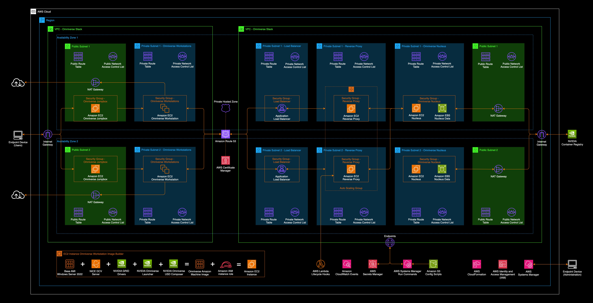

# NVIDIA Omniverse Modular Solution with AWS CDK

## Overview

This project is a modular AWS Cloud Development Kit (AWS CDK) solution that provides a starting place for NVIDIA Omniverse Workstations and/or Omniverse Enterprise Nucleus. Follow the below instructions and module guides to learn how to configure and deploy an NVIDIA Omniverse solution that best fits your use case. 

### What is NVIDIA Omniverse?

NVIDIA Omniverse is a scalable, multi-GPU, real-time, collaboration platform for building and operating 3D applications, based on Pixar's Universal Scene Description (USD) and NVIDIA RTX technology. USD is a powerful, extensible 3D framework and ecosystem that enables 3D designers and developers to connect and collaborate between industry-leading 3D content creation, rendering, and simulation applications. Omniverse helps individual creators and teams to connect and enhance their 3D artistic process, and enterprises to build and simulate large-scale virtual worlds for industrial applications.

Omniverse engages everyone involved in the lifecycle of 3D data with access to high-quality visualizations, authoring, and review tools. Teams do not need additional overhead to manage complex 3D data pipelines. Instead, they can focus on their unique contributions to bring value to the market. Non-technical stakeholders are able to gain valuable business insights from 3D data without the historically steep learning curve common to 3D applications.

## Contents

- [Architecture](#architecture)
- [Prerequisites](#prerequisites)
- [Getting Started](#getting-started)
- [Module Guides](#module-guides)
- [Clean Up](#clean-up)
- [Changelog](#changelog)
- [License](#license)

## Architecture

## Prerequisites

- AWS CLI: <https://docs.aws.amazon.com/cli/latest/userguide/getting-started-install.html>
- AWS CDK: <https://docs.aws.amazon.com/cdk/v2/guide/getting_started.html#getting_started_install>
- Docker: <https://www.docker.com/products/docker-desktop/>
- Python >=3.10: [https://www.python.org](https://www.python.org/)

### Omniverse Workstations Prerequisites

- NICE DCV Client: <https://download.nice-dcv.com/latest.html>

### Omniverse Nucleus Prerequisites

- Access to NVIDIA Enterprise Omniverse Nucleus packages: <https://docs.omniverse.nvidia.com/nucleus/latest/enterprise/installation/install-ove-nucleus.html#obtaining-the-enterprise-nucleus-server-docker-files>
- A domain and associated certificate are required to allow secure connections over HTTPS to the Nucleus server. Please reference the following link for more information: <https://docs.aws.amazon.com/acm/latest/userguide/setup-domain.html>
- Public hosted zone provisioned in Route53 and accessible by the AWS account. For more information on working with a Hosted Zone in Route53, please reference this documentation: <https://docs.aws.amazon.com/Route53/latest/DeveloperGuide/AboutHZWorkingWith.html>

## Getting Started

To get started with this project, after cloning the repository install the project dependencies by running `npm install` from the root of this project.

This project provides a tool to simplify the configuration and deployment process. To get started with the deployment tool run `npx omniverse-aws --deploy` and follow the prompts to select the Omniverse module (e.g Workstation AMI, Workstation Fleet, Enterprise Nucleus) that you'd like to deploy. Please see the Module Guides below for more information about each Omniverse module.

## Module Guides

Please reference the individual module guides for more detailed instructions on each module:

1. [Omniverse Workstation AMI](./docs/omniverse-workstation-ami/README.md)
2. [Omniverse Workstation Fleet](./docs/omniverse-workstation-fleet/README.md)
3. [Omniverse Nucleus](./docs/omniverse-nucleus/README.md)

## Clean Up

To teardown and delete the deployed infrastructure from your AWS account use the deployment tool and run `npx omniverse-aws --delete` in your CLI. Follow the prompts to verify the stacks that you deployed.

## Changelog

To view the history and recent changes to this repository, see the [CHANGELOG](./CHANGELOG.md)

## License

This code is licensed under the MIT-0 License. For more information, see the [LICENSE](./LICENSE)