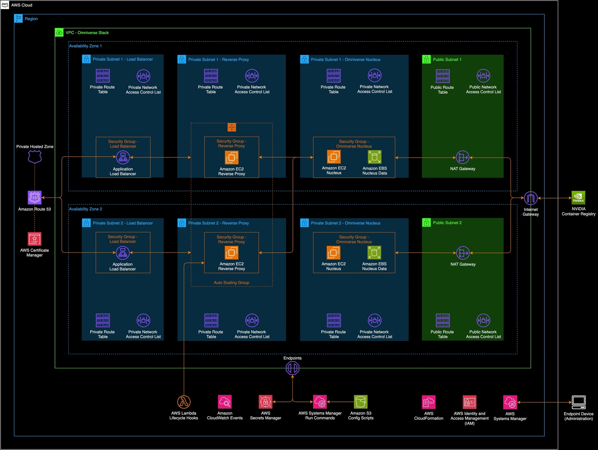

# NVIDIA Omniverse Nucleus on AWS deployment

A guide to deploy NVIDIA Omniverse Enterprise Nucleus on Amazon EC2.
Last updated on 04/2024.

## Overview
This guide includes steps to deploy a NVIDIA Omniverse Enterprise
Nucleus on Amazon EC2 using a multiple Availability Zone (AZ) approach.

## Contents
- [Prerequisites](#prerequisites)
- [Architecture](#architecture)
- [Instructions](#instructions)
  - [Step 1 – Downloading Nucleus Artifacts from NVIDIA](#step-1-downloading-nucleus-artifacts-from-nvidia)
  - [Step 2 – Configure and Deploy the AWS CDK Module](#step-2-configure-and-deploy-the-aws-cdk-module)
- [Troubleshooting](#troubleshooting)
  - [Unable to connect to the Nucleus Server](#unable-to-connect-to-the-nucleus-server)
  - [Additional NGINX Commands](#additional-nginx-commands)
  - [Additional Nucleus server notes](#additional-nucleus-server-notes)

## Prerequisites
- Access to NVIDIA Enterprise Omniverse Nucleus packages:
  <https://docs.omniverse.nvidia.com/nucleus/latest/enterprise/installation/install-ove-nucleus.html#obtaining-the-enterprise-nucleus-server-docker-files>
- A domain and associated certificate are required to allow secure
  connections over HTTPS to the Nucleus server. Please reference the
  following link for more information:
  <https://docs.aws.amazon.com/acm/latest/userguide/setup-domain.html>
- Public hosted zone provisioned in Route53 and accessible by the AWS
  account. For more information on working with a Hosted Zone in
  Route53, please reference this documentation:
  <https://docs.aws.amazon.com/Route53/latest/DeveloperGuide/AboutHZWorkingWith.html>

## Architecture

## Instructions
### Step 1 – Downloading Nucleus Artifacts from NVIDIA

- Download the Omniverse Enterprise Nucleus artifacts from NVIDIA. Feel
  free to leave the downloaded archive in your local Downloads folder.

### Step 2 – Configure and Deploy the AWS CDK Module

- In your CLI get started with the deployment tool by running `npx
  omniverse-aws --deploy`

- Choose NVIDIA Omniverse Enterprise Nucleus. This will configure the
  VPC and deploy the requires resources for Omniverse Nucleus on Amazon
  EC2 instances.

- If this is your first deployment, choose the option to create a new
  config file

- Provide your 12-digit AWS account ID

- Provide the AWS Region you want to deploy to (ex: us-east-1,
  us-west-2)

- If your account has not been bootstrapped for AWS CDK select ‘No’ to
  bootstrap

- Input the CIDR ranges that will be allowed to access your deployed
  solution. For individual IP address, add the /32 mask (ex:
  169.254.169.254/32).

- Enter the DNS domain that you will use for Nucleus (ex: mydomain.com)

- Navigate to and select the downloaded Nucleus archive

- Select how you will be accessing your Nucleus server: either from
  Omniverse Workstations or on-premises workstations

  - If you chose to access Nucleus from on-premises workstations,
    provide the ARN for your public SSL/TLS Certificate

- Verify the configured package and select ‘Yes’ to deploy

  - Note: It can take 20-30 minutes for all resources to be provisioned
    and in the running state.

## Troubleshooting
### Unable to connect to the Nucleus Server

If you are not able to connect to the Nucleus server, review the status
of the Nginx service, and the Nucleus docker stack. To do so, connect to
your instances from the EC2 Console via Session Manager -
<https://docs.aws.amazon.com/AWSEC2/latest/UserGuide/session-manager.html>.

On the Nginx Server, run \`sudo journalctl -u nginx.service\`, if this
is produces no output the Nginx service is not running. On the Nucleus
server, run \`sudo docker ps\`, you should see a list of Nucleus
containers up.

If there are issues with either of these, it is likely there was an
issue with the Lambda and/or SSM run commands that configure the
instances. Navigate to the Lambda Console in your web browser
and search for the respective Lambda Functions:

- OmniNucleusCustomResourceReverseProxyConfig

- OmniNucleusCustomResourceNucleusConfig

Review the CloudWatch Logs for these functions.​

### Additional NGINX Commands

Viewing Nginx Logs

sudo cat /var/log/nginx/error.log

sudo cat /var/log/nginx/access.log

Restart Nginx

systemctl restart nginx.service

### Additional Nucleus server notes

Review NVIDIA's Documentation -
<https://docs.omniverse.nvidia.com/nucleus/latest/enterprise/installation/install-ove-nucleus.html>

Default base stack and config location:

/opt/ove/

Default omniverse data dir:

/var/lib/omni/nucleus-data

Interacting with the Nucleus Server docker compose stack:

sudo docker-compose --env-file ./nucleus-stack.env -f
./nucleus-stack-ssl.yml pull

sudo docker-compose --env-file ./nucleus-stack.env -f
./nucleus-stack-ssl.yml up -d

sudo docker-compose --env-file ./nucleus-stack.env -f
./nucleus-stack-ssl.yml down

sudo docker-compose --env-file ./nucleus-stack.env -f
./nucleus-stack-ssl.yml ps

Generate new secrets

sudo rm -fr secrets && sudo ./generate-sample-insecure-secrets.sh
