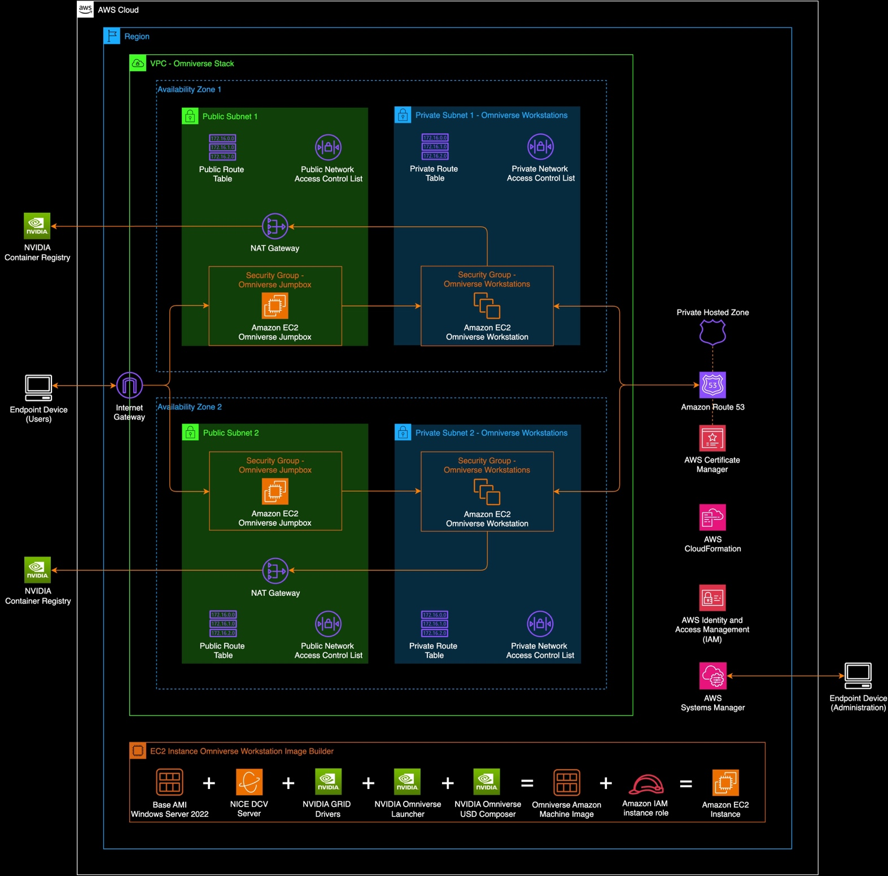
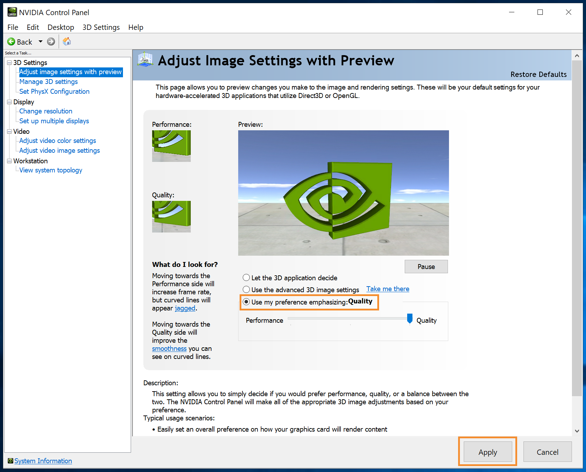
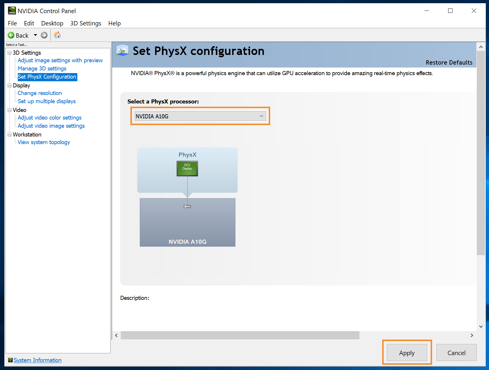
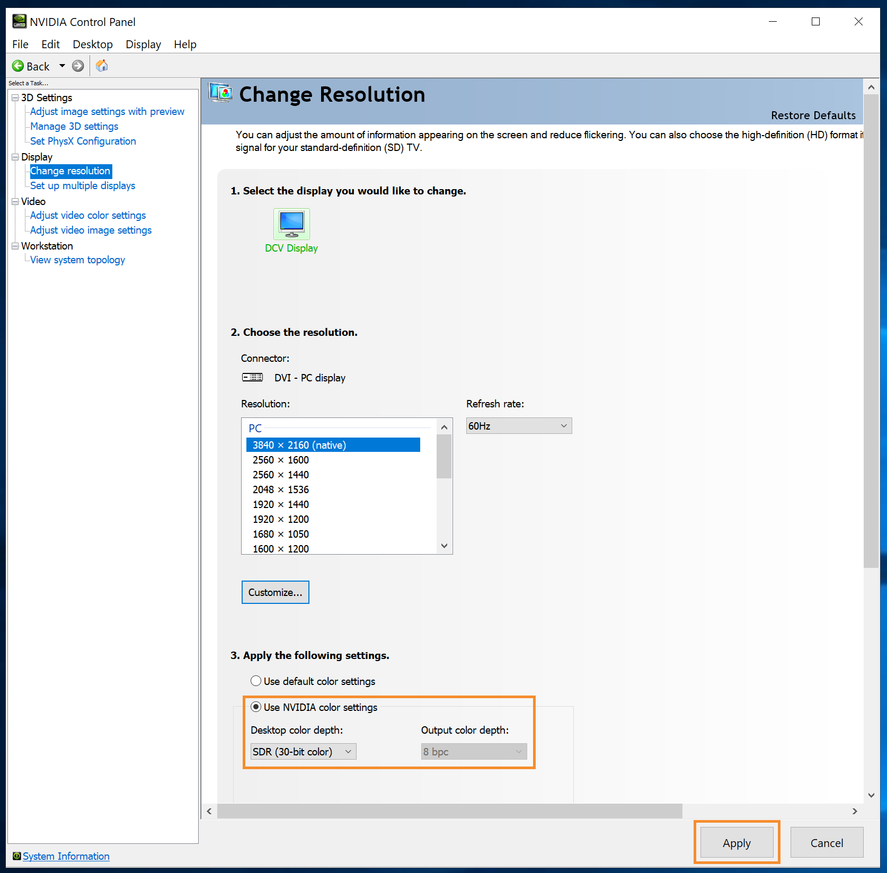
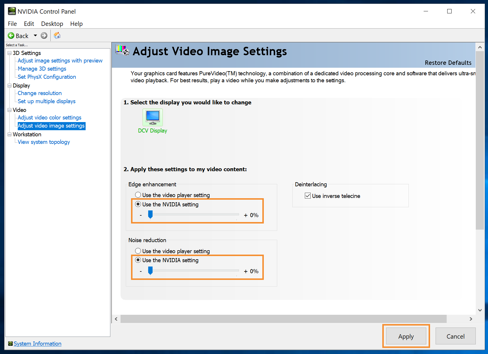

# NVIDIA Omniverse base Windows Workstation installation and setup

A guide to create a golden Amazon Machine Image (AMI) for an NVIDIA
Omniverse Workstation. Last updated on 04/2024.

## Overview

This guide includes steps to create a “golden” AMI for use to launch a
Windows Omniverse Workstation EC2 instances. This module can be deployed
in a single instance evaluation and included in more complex
deployments.

## Contents

- [Prerequisites](#prerequisites)
- [Architecture](#architecture)
- [Instructions](#instructions)
  - [Step 1 - Configure and Deploy the AWS CDK Module](#step-1-configure-and-deploy-the-aws-cdk-module)
  - [Step 2 - Retrieve Administrator password for the EC2 instance](#step-2-retrieve-administrator-password-for-the-ec2-instance)
  - [Step 3 - (recommended) Apply patches with Systems Manager (SSM)](#step-3-recommended-apply-patches-with-systems-manager-ssm)
  - [Step 4 - Connect to the instance using DCV Viewer](#step-4-connect-to-the-instance-using-dcv-viewer)
  - [Step 5 - (recommended) Enable 4K streaming resolution](#step-5-recommended-enable-4k-streaming-resolution)
  - [Step 6 - (recommended) Optimized Omniverse Launcher](#step-6-recommended-optimized-omniverse-launcher)
  - [Step 7 - (recommended) Optimize the NVIDIA GPU with the NVIDIA Control Panel](#step-7-recommended-optimize-the-nvidia-gpu-with-the-nvidia-control-panel)
  - [Step 8 - Install USD Composer (formerly Create)](#step-8-install-usd-composer-formerly-create)
  - [Step 9 – Create an Amazon Machine Image from the EC2 Instance](#step-9-–-create-an-amazon-machine-image-from-the-ec2-instance)

## Omniverse Workstation Components

The steps in this guide will install the following software for the
Omniverse Workstation.

1.  Windows Server 2022 Datacenter

2.  NVIDIA GRID drivers (v527.41)

3.  Amazon NICE DCV server

4.  NVIDIA Omniverse Launcher

5.  NVIDIA Omniverse USD Composer

## Prerequisites

- NICE DCV Client: <https://download.nice-dcv.com/latest.html>

## Architecture

## Instructions
### Step 1 – Configure and Deploy the AWS CDK Module

- In your CLI get started with the deployment tool by running `npx
  omniverse-aws --deploy`

- Choose NVIDIA Omniverse Workstation AMI. This will configure the VPC
  and deploy the base instance for creating an Omniverse golden AMI.

- If this is your first deployment, choose the option to create a new
  config file

- Provide your 12-digit AWS account ID

- Provide the AWS Region you want to deploy to (ex: us-east-1,
  us-west-2)

- If your account has not been bootstrapped for AWS CDK select ‘No’ to
  bootstrap

- Input the CIDR ranges that will be allowed to access your deployed
  solution. For individual IP address, add the /32 mask (ex:
  169.254.169.254/32).

- Select the EC2 instance type for the Omniverse Workstation

- Verify the configured package and select ‘Yes’ to deploy

  - Note: It can take 5-10 minutes for all resources to be provisioned
    and in the running state.

### Step 2 - Retrieve Administrator password for the EC2 instance

- Navigate to the **Systems Manager Console** \> **Application
  Management** \> **Parameter Store**

- In a new tab, navigate to the **EC2 Console** \> **Key Pairs**. Identify the key pair for the Omniverse workstation. Take note of it's ID

- Back in Parameter Store select the **EC2 Key Pair** that correlates to the ID of the Omniverse workstation. 

- Click **Show decrypted** value and copy the data

- Navigate to the **EC2 Console** \> **Instances**, select the workspace instance and click **Actions** \> **Security** \> **Get Windows password**

- Paste the workstation EC2 Key Pair under **Private key contents** and click **Decrypt password**

- Note the Username and Password values

### Step 3 - (recommended) Apply patches with Systems Manager (SSM)

- Navigate to the **Systems Manager Console** \> **Fleet Manager** \>
  **Manage nodes**

- NOTE: it will take several minutes before the instances are available
  after the CFN template completes

- Select the newly launched instance, then **Node actions** \> **Tools**
  \> **Patch nodes**

  - <u>Patching operation:</u> Scan and install

  - <u>Instances to patch:</u> Patch only the target instances I specify

  - <u>Managed instances:</u> Select the newly launched instance

  - Select **Patch now**

### Step 4 - Connect to the instance using DCV Viewer

- Navigate back to the **Key Pairs** page under the **EC2 console**. Take note of the ID for the Omniverse jump box

- Under Parameter Store, identify the key pair correlated to the jump box ID. Copy and paste the decrypted value found within to a new local file on your device

  - Create a \<key pair PEM file\>.pem file on your local device

  - Change the file permissions to RWX for example, chmod 777 \<key pair
    PEM file\>.pem

  - Paste the EC2 Key Pair contents into the file

  - Set the files permission to read-only, for example chmod 400 \<key
    pair PEM file\>.pem

- Open **SSH tunnel** with the EC2 private and public IPs obtained from
  the EC2 Console

  - ssh -i ./\<key pair PEM file\> -L 8888:\<workstation private
    IP\>**:8443 ec2-user@**\<jumpbox public IP\>

  - Note: If you are having troubles establishing a SSH tunnel, check the Jumpbox instance's security group. Make sure your IP address is allowed in the security group by modifying **Inbound rules**. For more information click [here](https://docs.aws.amazon.com/vpc/latest/userguide/working-with-security-group-rules.html)

- Launch **DCV Viewer** (or download the client from
  [here](https://download.nice-dcv.com/))

- Connect to **localhost:8888**

- Supply the user credentials obtained from step 2

### Step 5 - (recommended) Enable 4K streaming resolution

- Change the Windows display settings on the Workstation

  - Open the **Display settings**

  - Change the **Display resolution** to 3840 x 2160 if your device
    supports a 4K resolution

  - Adjust the **Scale** to 150 or 175% depending on your preference

  - Close the **Display Settings**

- Change the DCV Viewer settings on your local device

  - Open the **DCV Viewer** \> **Preferences** menu

  - Change the **Display resolution** to 3840 x 2160

  - Enable the **Best image quality mode**

  - Check the **High color accuracy**, **Accurate Audio/Video
    Synchronization**, and **High pixel density options**

### Step 6 - (recommended) Optimized Omniverse Launcher

- Close **Omniverse Launcher**

  - Right-click on **Omniverse Launcher** in the systems tray and
    unselect the **Launch on login option**

  - Right-click on **Omniverse Launcher** in the systems tray and select
    the **Exit** option

  - Right-click on the **Omniverse Launcher** on the desktop and select
    **Properties**

    - On the **Shortcut tab**, click **Advanced** and select **Run as
      administrator**, then **OK**

    - On the **Shortcut tab**, change the run mode to **Maximized**,
      then **OK**

- Launch **Omniverse Launcher**

### Step 7 - (recommended) Optimize the NVIDIA GPU with the NVIDIA Control Panel

- Open **NVIDIA Control Panel**

- Under **3D Settings**, select **Adjust image settings with preview**.
  Select **Use my preference emphasizing: Quality** and click **Apply**.

>  style="width:5.50888in;height:4.43873in" />

- Under **3D Settings**, select **Set PhysX Configuration**. Select the
  **NVIDIA A10g GPU** and click **Apply**.

>  style="width:5.58493in;height:4.21869in" />

- Under **Display**, select **Change resolution**. Select the **Use
  NVIDIA color settings** in step 3, then change the **Desktop color
  depth** to **30-bit**, and click **Apply**.

>  style="width:5.58458in;height:5.49771in" />

- Under **Video**, select **Adjust video color settings**. Select **With
  the NVIDIA settings** and click **Apply**.

>  style="width:5.62117in;height:4.29811in" />

- Under **Video**, select **Adjust video image settings**. Select **Use
  the NVIDIA settings** for both options with step 2 and click
  **Apply**.

>  style="width:5.60815in;height:4.07577in" />

### Step 8 - Install USD Composer (formerly Create)

- The first time Omniverse Launcher is launched after the installation
  requires some additional setup. Follow the wizard to complete the
  setup.

  - NOTE: you can skip the installation of Cache

  - NOTE: you will need an NVIDIA account to access items in the
    Exchange

- From within the **Omniverse Launcher** application, click on the
  **Exchange** menu

- Search for **USD Composer** and select **install**

- NOTE: This will take several minutes

- Once complete, launch **USD Composer** to verify it was correctly
  installed

- This concludes the setup process. Enjoy building with NVIDIA
  Omniverse!

### Step 9 – Create an Amazon Machine Image from the EC2 Instance

- From the EC2 console, select your base instance, select Actions \>
  Image and Templates \> Create Image

- Name your Amazon Machine Image (example: omni-workstation-golden-ami)
  and click Create Image

- Creating the AMI from the Instance will take 30-45 minutes. Once
  complete note the AMI ID for use in creating your Omniverse
  Workstation Fleet.
