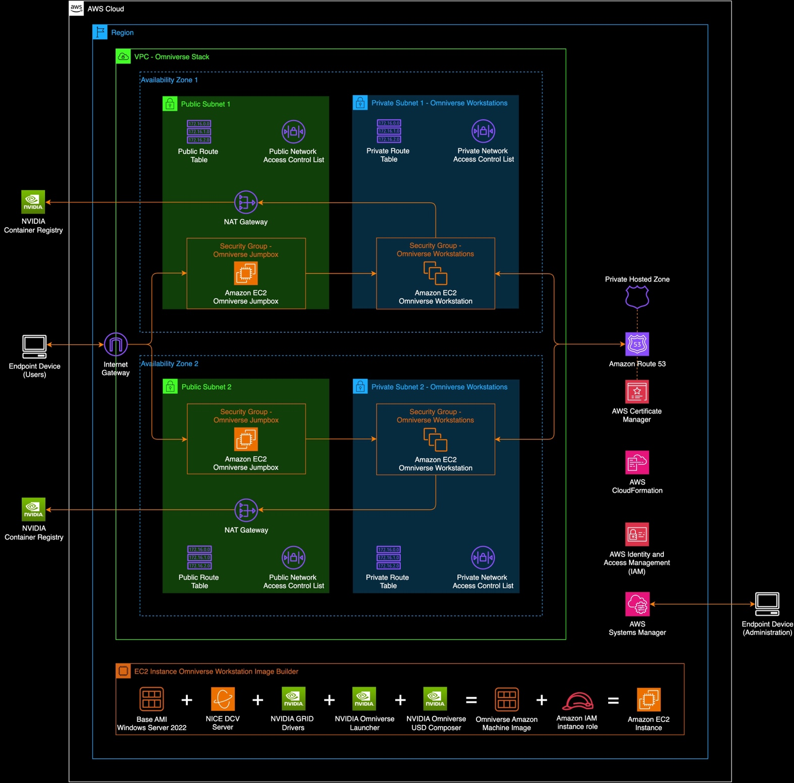

# NVIDIA Omniverse Windows Workstation Fleet deployment

A guide to create a fleet of Amazon EC2 NVIDIA Omniverse Workstations.
Last updated on 04/2024.

## Overview

This guide includes steps to create a fleet of Amazon EC2 NVIDIA
Omniverse Workstations based on the AMI created in the NVIDIA Omniverse
Base Windows Workstation guide.

## Contents
- [Prerequisites](#prerequisites)
- [Architecture](#architecture)
- [Instructions](#instructions)
    - [Step 1 - Configure and Deploy the AWS CDK Module](#step-1-configure-and-deploy-the-aws-cdk-module)
    - [Step 2 - Connect to the instance using DCV Viewer](#step-2-connect-to-the-instance-using-dcv-viewer)

## Prerequisites
- Golden AMI for the NVIDIA Omniverse workstation. To get started
  creating the AMI, [please reference the NVIDIA Omniverse Base Windows Workstation guide.](../omniverse-workstation-ami/README.md)
- NICE DCV Client: <https://download.nice-dcv.com/latest.html>

## Architecture

## Instructions
### Step 1 – Configure and Deploy the AWS CDK Module
- In your CLI get started with the deployment tool by running `npx omniverse-aws --deploy`
- Choose NVIDIA Omniverse Workstation Fleet. This will configure the VPC
  and deploy the instances for creating an Omniverse workstation fleet
  based on the golden AMI.
- If you previously deployed the Workstation AMI stack, select to update
  the config file. If not, please deploy the Workstation AMI stack
  following the Workstation AMI guide.
- Verify you have created the Workstation AMI by selecting ‘Yes’
- Supply the AMI ID in the form of ‘ami-****************’
- Enter the number of workstations you would like to create
- Select the EC2 instance type for the Omniverse Workstation
- Verify the configured package and select ‘Yes’ to deploy
  - Note: It can take 10-15 minutes for all resources to be provisioned
    and in the running state.

### Step 2 - Connect to the instance using DCV Viewer
- The EC2 Key Pair used to connect to the Jumpbox should be the same Key
  Pair used to access the Jumpbox instance from the Workstation AMI
  guide.
- To create a new version of this Key Pair, copy the **EC2 Key Pair** to
  a new local file on your device.
  - Create a \<key pair PEM file\>.pem file on your local device
  - Change the file permissions to RWX for example, chmod 777 \<key pair
    PEM file\>.pem
  - Paste the EC2 Key Pair contents into the file
  - Set the files permission to read-only, for example chmod 400 \<key
    pair PEM file\>.pem
- Open **SSH tunnel** with the EC2 private and public IPs obtained from
  the EC2 Console
  - ssh -i ./\<key pair PEM file\> -L 8888**:\<workstation private
    IP\>**:8443 ec2-user@**\<jumpbox public IP\>**
- Launch **DCV Viewer** (or download the client from [here](https://download.nice-dcv.com/))
- Connect to **localhost:8888**
- Supply the user credentials setup in the AMI Workstation guide