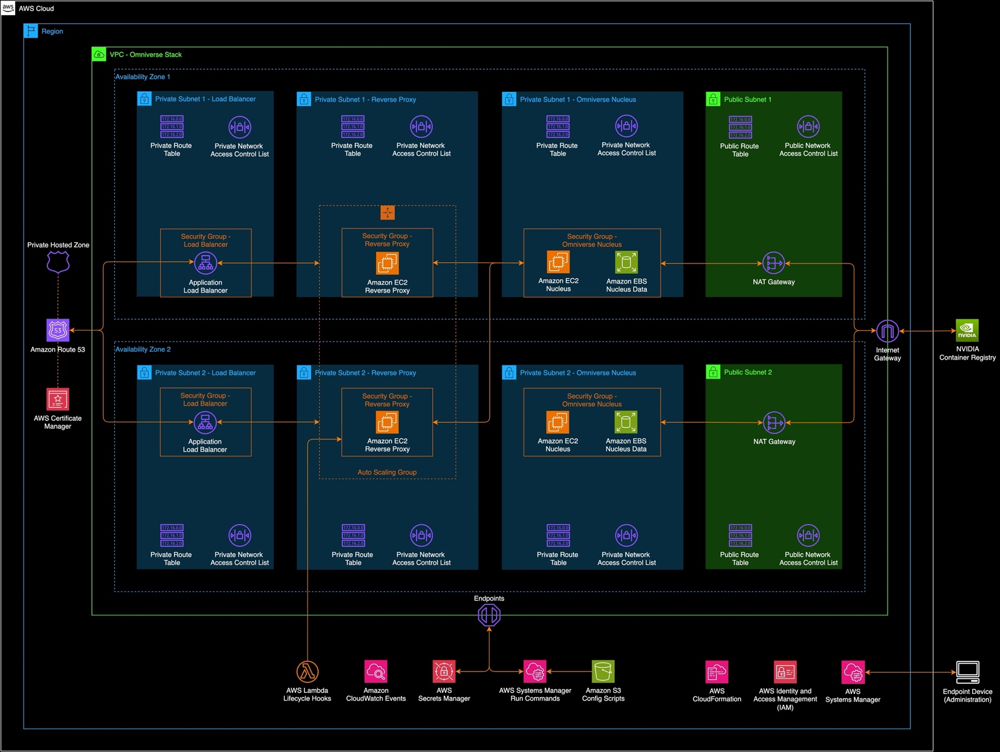

# NVIDIA Omniverse Nucleus on AWS deployment

A guide to deploy NVIDIA Omniverse Enterprise Nucleus on Amazon EC2.
Last updated on 03/2024.

## Overview

This guide includes steps to deploy a NVIDIA Omniverse Enterprise on
Amazon EC2 using a multiple Availability Zone (AZ) approach. This module
also deploys Omniverse Workstations, based on a golden Amazon Machine
Image (AMI), that have access to the Nucleus instance.

## Contents

- [Prerequisites](#prerequisites)

- [Architecture](#_Architecture)

- [Instructions](#instructions)

  - [Step 1 –
    Downloading](#step-1-downloading-nucleus-artifacts-from-nvidia)
    Nucleus Artifacts from NVIDIA

  - [Step 2 – Configuring](#_2/_Retrieve_Administrator) the AWS CDK
    Project

  - [Step 3 – Installing Dependencies and Bootstrapping AWS](#_Step_3_–)

  - [Step 4 – Deploy the Stack](#_Step_4_–)

- [Teardown](#_Teardown_1)

- [Troubleshooting](#troubleshooting)

  - [Unable to connect to the Nucleus
    Server](#unable-to-connect-to-the-nucleus-server) NVIDIA

  - [No service log entries, or unable to restart nitro-enclave
    service](#no-service-log-entries-or-unable-to-restart-nitro-enclave-service)

  - [Additional NGINX Commands](#additional-nginx-commands)

  - [Additional Nucleus server notes](#additional-nucleus-server-notes)

## Prerequisites

- AWS
  CLI: <https://docs.aws.amazon.com/cli/latest/userguide/getting-started-install.html>

- AWS
  CDK: <https://docs.aws.amazon.com/cdk/v2/guide/getting_started.html#getting_started_install>

- Docker: <https://www.docker.com/products/docker-desktop/>

- Python 3.9 or
  greater: [https://www.python.org](https://www.python.org/)

- Access to NVIDIA Enterprise Omniverse Nucleus packages:
  <https://docs.omniverse.nvidia.com/prod_nucleus/prod_nucleus/enterprise/installation/quick_start_tips.html>

- NICE DCV Client: <https://download.nice-dcv.com/latest.html>

- Public hosted zone provisioned in Route53 and accessible by the AWS
  account. For more information on working with a Hosted Zone in
  Route53, please reference this documentation:
  <https://docs.aws.amazon.com/Route53/latest/DeveloperGuide/AboutHZWorkingWith.html>

## Architecture



## Instructions

### Step 1 – Downloading Nucleus Artifacts from NVIDIA

- <span id="_2/_Retrieve_Administrator" class="anchor"></span>Download
  the Omniverse Enterprise Nucleus artifacts from NVIDIA and place them
  in ‘./shared/src/tools/nucleusServer/stack/’

- This deployment has a templated copy of nucleus-stack.env located at
  ‘./shared/src/tools/nucleusServer/templates/nucleus-stack.env’ this
  may need to be updated if NVIDIA makes changes to the
  nucleus-stack.env file packaged with their archive.

### Step 2 – Configuring the AWS CDK Project

- In \`./config\` create a file named \`app.config.json\`. This file is
  used to configure the Stacks on deployment. See the below template for
  the expected schema:
```
{
  "name": "omni",
  "env": {
    "account": "ACCOUNT_ID",
    "region": "AWS_REGION"
  },
  "availabilityZones": 2,
  "removalPolicy": "destroy",
  "autoDelete": true,
  "cdkNag": false,
  "stacks": {
    "vpc": {
      "name": "vpc",
      "allowedRanges": ["CIDR_RANGE"]
    },
    "workstation": {
      "name": "workstation",
      "jumpboxInstanceType": "t4g.small",
      "workstationAmiName": "WORKSTATION_AMI_NAME",
      "workstationAmiId": "WORKSTATION_AMI_ID",
      "workstationInstanceType": "g5.2xlarge",
      "workstationQuantity": 2
    },
    "nucleus": {
      "name": "nucleus",
      "rootDomain": "ROOT_DOMAIN",
      "nucleusSubdomain": "nucleus",
      "nucleusBuild": "NUCLEUS_BUILD"
    }
  }
}
```
### Step 3 – Installing Dependencies and Bootstrapping AWS

- Install the dependency packages for the project. From your CLI run:
  npm install

- Build the shared dependency package. From your CLI run: nx run
  omniverse-shared:build

- To prepare your AWS account for the CDK application start by
  bootstrapping: cdk bootstrap \<ACCOUNT_ID\>/\<AWS_REGION\>

- Once that is complete, synthesize the CDK application to verify the
  configuration is correct: cdk synth

### Step 4 – Deploy the Stack

- Now, deploy the stacks to create the VPC, networking resources,
  Nucleus solution, and Omniverse Workstations: cdk deploy --all

- If you changed the names of the stacks or application in the
  app.config.json this step will be in the form of: \`cdk deploy
  \<config.name\>-\<config.stacks.infra.name\>\`

  - Note: It can take 20-30 minutes for all resources to be provisioned
    and in the running state.

## Teardown

The teardown process requires a mix of manual and automated steps.
Follow the below steps to remove deployed resources from the AWS
account.

1.  The Nucleus Primary and Nucleus Standby EC2 instances have
    Termination Protection enabled. Begin by navigating the EC2 Console
    and disabling Termination Protection. This option is found under
    Actions \> Instance Settings \> Change termination protection. Once
    the modal pops-up, untick the "Enable" box.

2.  Next, navigate to the Route53 Console and select the private hosted
    zone. In the hosted zone details, delete the CNAME and A record
    entries.

3.  Once Steps 1 and 2 are complete, the rest of the teardown process
    can be automated with CloudFormation. Navigate to the CloudFormation
    Console. Deleting the CloudFormation Stacks is a 2 step process
    starting with the omni-workstation. Select the omni-workstation and
    select Delete.

4.  Once the omni-workstation has completed deleting, select the
    omni-vpc and select Delete. Since the VPC and Nucleus stacks are
    nested within the omni-vpc, they will be deleted alongside it. When
    the omni-vpc has been deleted the teardown process is complete.

## Troubleshooting

### Unable to connect to the Nucleus Server

If you are not able to connect to the Nucleus server, review the status
of the Nginx service, and the Nucleus docker stack. To do so, connect to
your instances from the EC2 Console via Session Manager -
<https://docs.aws.amazon.com/AWSEC2/latest/UserGuide/session-manager.html>.

On the Nginx Server, run sudo journalctl -u nginx.service, if this is
produces no output the Nginx service is not running. On the Nucleus
server, run sudo docker ps, you should see a list of Nucleus containers
up.

If there are issues with either of these, it is likely there was an
issue with the Lambda and/or SSM run commands that configure the
instances. Browse to the Lambda Console
(<https://us-west-2.console.aws.amazon.com/lambda/home?region=us-west-2#/functions>)
and search for the respective Lambda Functions:

- ReverseProxyConfig-CustomResource

- NucleusServerConfig-CustomResource

Review the CloudWatch Logs for these functions.​

### No service log entries, or unable to restart nitro-enclave service

If there are issues with either of these, it is likely there was an
issue with the Lambda and/or SSM run commands that configure the
instances. Browse to the Lambda Console and search for the
ReverseProxyConfig-CustomResource Lambda Function, then review the
CloudWatch Logs.

At times the Reverse Proxy custom resource Lambda function does not
trigger on a initial stack deployment. If the reverse proxy instance is
in a running state, but there are now invocations/logs, terminate the
instance and give the auto scaling group a few minutes to create another
one, and then try again. Afterwards, check the CloudWatch Logs for the
Lambda function: ReverseProxyAutoScalingLifecycleLambdaFunction

### Additional NGINX Commands

View Nitro Enclaves Service Logs:

sudo journalctl -u nginx.service

Viewing Nginx Logs

sudo cat /var/log/nginx/error.log

sudo cat /var/log/nginx/access.log

Restart Nginx

systemctl restart nginx.service

### Additional Nucleus server notes

Review NVIDIA's Documentation -
<https://docs.omniverse.nvidia.com/prod_nucleus/prod_nucleus/enterprise/installation/quick_start_tips.html>

Default base stack and config location:

/opt/ove/

Default omniverse data dir:

/var/lib/omni/nucleus-data

Interacting with the Nucleus Server docker compose stack:

sudo docker-compose --env-file ./nucleus-stack.env -f
./nucleus-stack-ssl.yml pull

sudo docker-compose --env-file ./nucleus-stack.env -f
./nucleus-stack-ssl.yml up -d

sudo docker-compose --env-file ./nucleus-stack.env -f
./nucleus-stack-ssl.yml down

sudo docker-compose --env-file ./nucleus-stack.env -f
./nucleus-stack-ssl.yml ps

Generate new secrets

sudo rm -fr secrets && sudo ./generate-sample-insecure-secrets.sh
