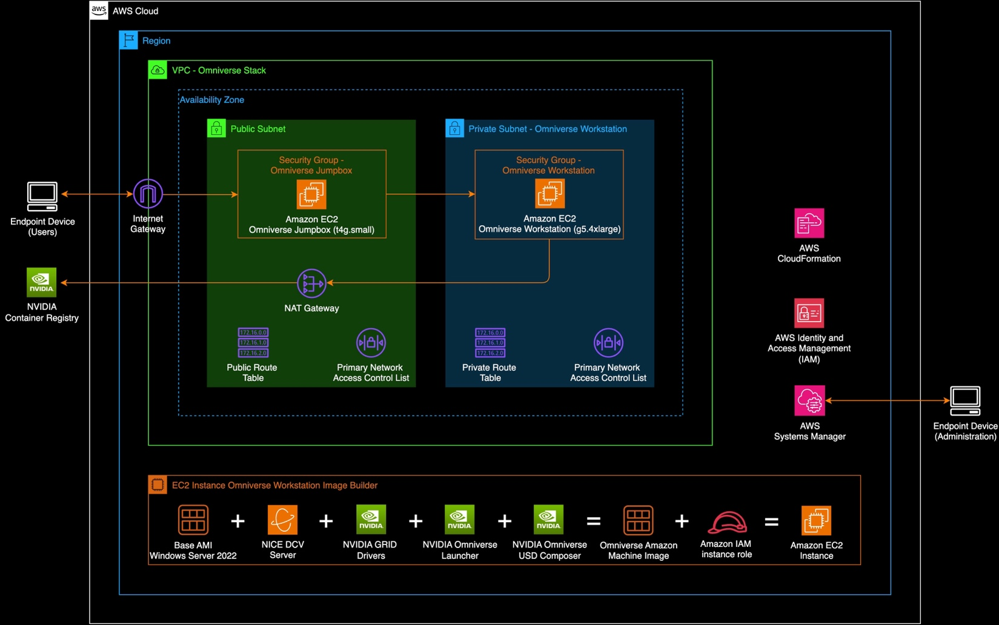
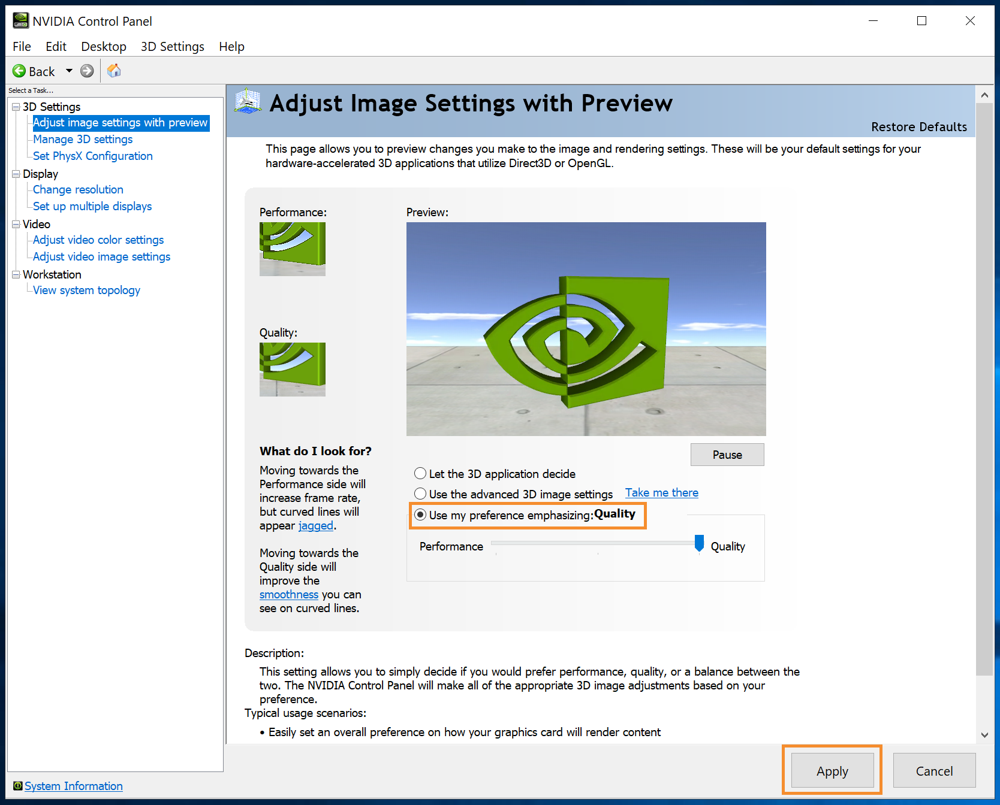
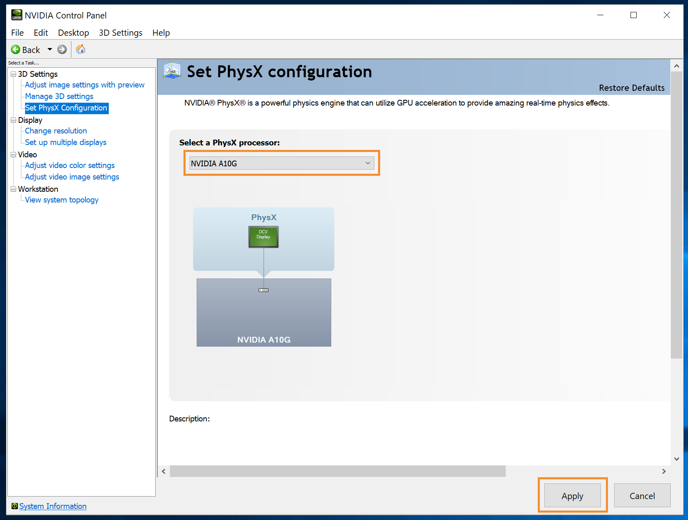
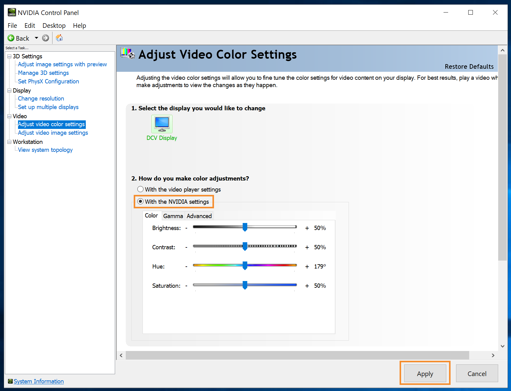
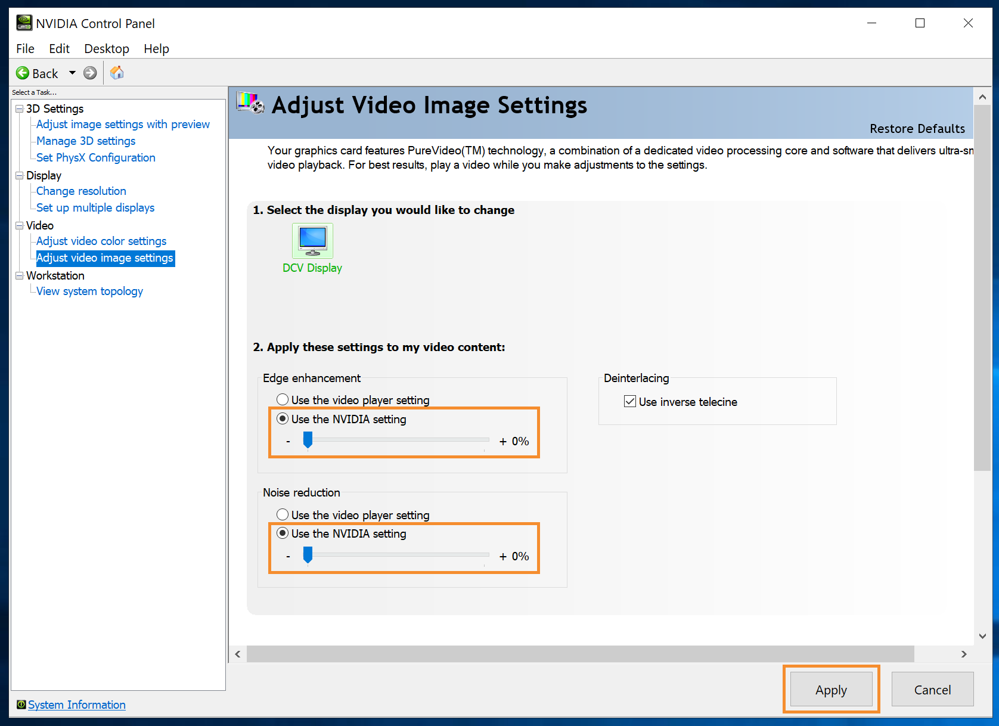

# NVIDIA Omniverse base Workstation installation and setup

A guide to create a golden Amazon Machine Image (AMI). Last updated on
11/2023.

## Overview

This guide includes steps to create a “golden” AMI for use to launch
Omniverse Workstation EC2 instances. This module can be deployed in a
single instance evaluation and included in more complex deployments.

## Contents

- [1/ Deploy VPC CloudFormation (CFN)
  template](#1-deploy-vpc-cloudformation-cfn-template)

- [2/ Retrieve Administrator password for the EC2
  instance](#retrieve-administrator-password-for-the-ec2-instance)

- [3/ (recommended) Apply patches with Systems Manager
  (SSM)](#recommended-apply-patches-with-systems-manager-ssm)

- [4/ Connect to the instance using DCV
  Viewer](#connect-to-the-instance-using-dcv-viewer)

- [5/ (recommended) Enable 4K streaming
  resolution](#recommended-enable-4k-streaming-resolution)

- [6/ (recommended) Optimized Omniverse
  Launcher](#recommended-optimized-omniverse-launcher)

- [7/ (recommended) Optimize the NVIDIA GPU with the NVIDIA Control
  Panel](#recommended-optimize-the-nvidia-gpu-with-the-nvidia-control-panel)

- [8/ Install USD Composer (formerly
  Create)](#install-usd-composer-formerly-create)

## Omniverse Workstation Components

The steps in this guide will install the following software for the
Omniverse Workstation.

1.  Windows Server 2022 Datacenter

2.  NVIDIA GRID drivers (v527.41)

3.  Amazon NICE DCV server

4.  NVIDIA Omniverse Launcher

5.  NVIDIA Omniverse USD Composer

## Architecture

## Steps

### 1/ Deploy VPC CloudFormation (CFN) template

- Navigate to the **CloudFormation Console**

- Deploy the CFN template *omniverse-workstation.yaml* and enter the
  following parameters

  - <u>Stack name:</u> omniverse

  - <u>Availability Zones:</u> Select one within the current Region

  - <u>VPC CIDR:</u> Enter the first two octets of the VPC CIDR block

  - <u>Endpoint device IP:</u> Enter the public IP of the endpoint
    device that will be used to connect to the Windows Server instance

  - <u>Omniverse Workstation Instance Size:</u> Select the best match or
    use the default

  - <u>Jumpbox Instance Size:</u> Select the best match or use the
    default

  - NOTE: the CFN template will take about 5 minutes to deploy.

  - NOTE: there is a post-CFN setup process that will take about 15
    minutes before the Workstation is available.

- NOTE: there is an installation log located in
  C:\Users\Administrator\Documents\setup_verification_log.txt

### 2/ Retrieve Administrator password for the EC2 instance

- Navigate to the **Systems Manager Console** \> **Application
  Management** \> **Parameter Store**

- Select the **EC2 Key Pair** that was created by the CFN template

- Click **Show decrypted** value and copy the data

- Navigate to the **EC2 Console** \> **Instances, select the instance
  and click Actions** \> **Security** \> **Get Windows password**

- Paste the EC2 Key Pair and click **Decrypt password**

- Note the Username and Password values

### 3/ (recommended) Apply patches with Systems Manager (SSM)

- Navigate to the **Systems Manager Console** \> **Fleet Manager** \>
  **Manage nodes**

- NOTE: it will take several minutes before the instances are available
  after the CFN template completes

- Select the newly launched instance, then **Node actions** \> **Tools**
  \> **Patch nodes**

  - <u>Patching operation:</u> Scan and install

  - <u>Instances to patch:</u> Patch only the target instances I specify

  - <u>Managed instances:</u> Select the newly launched instance

  - Select **Patch now**

### 4/ Connect to the instance using DCV Viewer

- Copy the **EC2 Key Pair** to a new local file on your device

  - Create a \<key pair PEM file\>.pem file on your local device

  - Change the file permissions to RWX for example, chmod 777 \<key pair
    PEM file\>.pem

  - Paste the EC2 Key Pair contents into the file

  - Set the files permission to read-only, for example chmod 400 \<key
    pair PEM file\>.pem

- Open **SSH tunnel** with the EC2 private and public IPs obtained from
  the EC2 Console

  - ssh -i ./\<key pair PEM file\> -L 8888**:\<workstation private
    IP\>**:8443 ec2-user@**\<jumpbox public IP\>**

- Launch **DCV Viewer** (or download the client from
  [here](https://download.nice-dcv.com/))

- Connect to **localhost:8888**

- Supply the user credentials obtained from a step 2

### 5/ (recommended) Enable 4K streaming resolution

- Change the Windows display settings on the Workstation

  - Open the **Display settings**

  - Change the **Display resolution** to 3840 x 2160 if your device
    support a 4K resolution

  - Adjust the **Scale** to 150 or 175% depending on your preference

  - Close the **Display Settings**

- Change the DCV Viewer settings on your local device

  - Open the **DCV Viewer** \> **Preferences** menu

  - Change the **Display resolution** to 3840 x 2160

  - Enable the **Best image quality mode**

  - Check the **High color accuracy**, **Accurate Audio/Video
    Synchronization**, and **High pixel density options**

### 6/ (recommended) Optimized Omniverse Launcher

- Close **Omniverse Launcher**

  - Right-click on **Omniverse Launcher** in the systems tray and
    unselect the **Launch on login option**

  - Right-click on **Omniverse Launcher** in the systems tray and select
    the **Exit** option

  - Right-click on the **Omniverse Launcher** on the desktop and select
    **Properties**

    - On the **Shortcut tab**, click **Advanced** and select **Run as
      administrator**, then **OK**

    - On the **Shortcut tab**, change the run mode to **Maximized**,
      then **OK**

- Launch **Omniverse Launcher**

### 7/ (recommended) Optimize the NVIDIA GPU with the NVIDIA Control Panel

- Open **NVIDIA Control Panel**

- Under **3D Settings**, select **Adjust image settings with preview**.
  Select **Use my preference emphasizing: Quality** and click **Apply**.

>  style="width:5.50888in;height:4.43873in" />

- Under **3D Settings**, select **Set PhysX Configuration**. Select the
  **NVIDIA A10g GPU** and click **Apply**.

>  style="width:5.58493in;height:4.21869in" />

- Under **Display**, select **Change resolution**. Select the **Use
  NVIDIA color settings** in step 3, then change the **Desktop color
  depth** to **30-bit**, and click **Apply**.

>  style="width:5.58458in;height:5.49771in" />

- Under **Video**, select **Adjust video color settings**. Select **With
  the NVIDIA settings** and click **Apply**.

>  style="width:5.62117in;height:4.29811in" />

- Under **Video**, select **Adjust video image settings**. Select **Use
  the NVIDIA settings** for both options with step 2 and click
  **Apply**.

>  style="width:5.60815in;height:4.07577in" />

### 8/ Install USD Composer (formerly Create)

- The first time Omniverse Launcher is launched after the installation
  requires some additional setup. Follow the wizard to complete the
  setup.

  - NOTE: you can skip the installation of Cache

  - NOTE: you will need an NVIDIA account to access items in the
    Exchange

- From within the **Omniverse Launcher** application, click on the
  **Exchange** menu

- Search for **USD Composer** and select **install**

- NOTE: This will take several minutes

- Once complete, launch **USD Composer** to verify it was correctly
  installed

- This concludes the setup process. Enjoy building with NVIDIA
  Omniverse!
